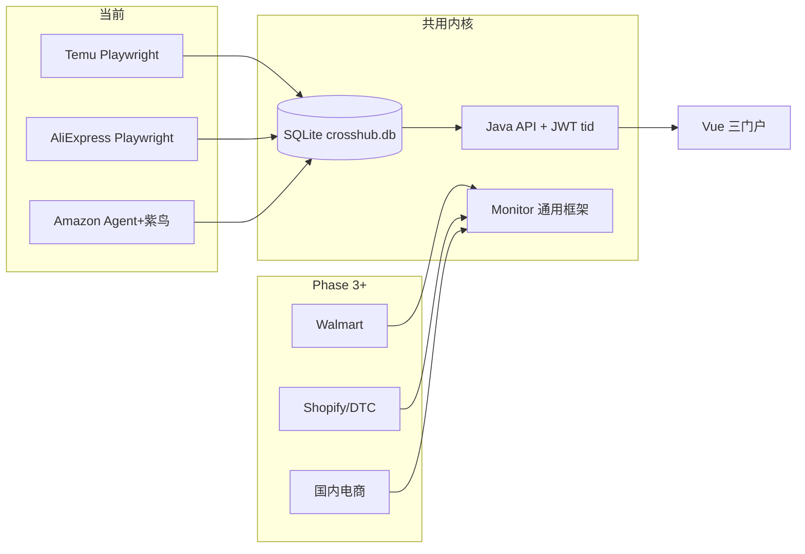

# 聚合平台 SaaS（CrossHub）

跨境电商 **多平台聚合运营** SaaS 系统：Boss / 运营 / 仓管三门户，多租户隔离，菜单与数据权限，Temu / AliExpress / Amazon 等平台运营与仓库协同。

**在线演示：** https://www.yoto.work/crosshub/

**仓库：** https://github.com/2836240651/juhepingtaiSass

---

## 功能概览

| 能力 | 说明 |
|------|------|
| **三门户** | Boss 管理端、运营员工端、仓库管理员端 |
| **多租户** | JWT 租户隔离（`tid`）、成员管理、功能开关 |
| **权限体系** | 菜单授权、平台/店铺/分仓数据范围 |
| **跨境平台** | Temu、AliExpress、Amazon、Walmart、1688 |
| **国内电商** | 拼多多、抖音、视频号 |
| **独立站** | Shopify / WordPress 演示模块 |
| **Temu 真爬取** | Playwright 爬数 → SQLite → Java API → 前端预警 |
| **AliExpress** | 订单/违规/热榜，Java + Python 爬虫联调 |
| **Amazon** | 紫鸟同步助手、运营数据、Agent 节点 |
| **仓库协同** | 分仓设置、出库单审批、仓管任务中心 |
| **任务分配** | Boss 向运营/仓管分配任务，反馈时间线同步 |

---

## 已开发爬虫的三大平台

当前已完成 **Python 爬虫 / 同步引擎 + Java 读 API + Vue 刷新闭环** 的平台共三个。统一数据流：

```
浏览器 / 紫鸟 WebDriver / Agent
    ↓ 爬取 / 同步
backend/data/crosshub.db（SQLite，按 tenant_id 隔离）
    ↓ JPA 读取
Java API (:18080)
    ↓ Vite 代理
Vue 运营模块（刷新 → 异步任务 → 轮询 → 重载）
```

### 1. Temu（Playwright 卖家后台）

| 项 | 说明 |
|----|------|
| **爬虫引擎** | Playwright 持久化 Profile + 卖家后台 API（`temu_crawler.py`） |
| **登录** | `py login.py --tenant-id <id>`，Profile：`.temu-browser-profile/tenant-{id}` |
| **爬取入口** | `py crawl.py --tenant-id <id>` 或统一入口 `operational_crawl.py --platform temu` |
| **Java API** | `POST /api/temu/crawl`、`GET /api/temu/operational`、`GET /api/temu/trend` |
| **抓取内容** | 全托管销量、四类运营预警（价损/滞销/补货/热卖）、销量趋势 |
| **扩展能力** | 竞店监控（`competitor_crawl.py` + `/api/monitor`）、热榜播报、备货跟进 |
| **前端入口** | Boss / 员工 → **Temu 运营** → 刷新数据 |

### 2. AliExpress（Playwright 全托管 CSP）

| 项 | 说明 |
|----|------|
| **爬虫引擎** | Playwright + CSP 卖家后台 API（`aliexpress_crawler.py`） |
| **登录** | `py login_aliexpress.py --tenant-id <id>`，Profile：`.aliexpress-browser-profile/tenant-{id}` |
| **爬取入口** | `operational_crawl.py --platform aliexpress --scope all\|orders\|violations\|operational` |
| **Java API** | `POST /api/aliexpress/crawl`、`GET /api/aliexpress/operational/orders/violations/hot-broadcasts` |
| **抓取内容** | JIT 订单、仓发备货单、违规处罚、商品运营数据、热卖播报 |
| **前端入口** | Boss / 员工 → **AliExpress 运营** → 刷新数据 / 刷新违规 |

### 3. Amazon（紫鸟 WebDriver + 本地 Agent）

| 项 | 说明 |
|----|------|
| **爬虫引擎** | 紫鸟隔离浏览器 + Playwright CDP（`app/amazon/report_crawler.py`） |
| **运行方式** | 办公机安装紫鸟 WebDriver + CrossHub **同步助手 Agent**（`scripts/run-agent.ps1`） |
| **触发链路** | 前端刷新 → `POST /api/amazon/sync` → Java 下发 Agent 任务 → Agent 调紫鸟爬取 → 入库 |
| **Java API** | `POST /api/amazon/sync`、`GET /api/amazon/daily/insights`、`POST /api/amazon/ziniao/bind` |
| **抓取 scope** | 账户状况、订单、消息、评论、优惠券、FBA 入库、Business Report、广告、库存等 |
| **前置条件** | 紫鸟 Boss 账号、WebDriver 端口、Agent Token（Boss → Amazon 同步助手） |
| **前端入口** | Boss / 员工 → **Amazon 运营** → 刷新；Boss → **Amazon 同步助手** 管理节点 |

> **说明**：Temu / AliExpress 由 Java 直接 fork Python 脚本；Amazon 因账号隔离依赖紫鸟，必须通过 **Agent 长连接** 在本地 Windows 执行，云端 Java 仅调度任务与读库。

### 平台联调状态（其余模块）

| 平台 / 模块 | 后端 API | 爬虫/同步 | 说明 |
|-------------|----------|-----------|------|
| **Temu** | ✅ | ✅ Playwright | 完整闭环 + 竞店监控 |
| **AliExpress** | ✅ | ✅ Playwright | 订单 / 违规 / 热榜 |
| **Amazon** | ✅ | ✅ Agent + 紫鸟 | 需本地 Agent 在线 |
| 仓库 / 租户 / 账户 | ✅ | — | 生产可用 |
| Walmart / 1688 / DTC / 国内 | 前端 Demo | 模拟刷新 | 待 Phase 3 扩展 |
| 竞店监控（跨平台框架） | ✅ `/api/monitor` | ✅ Temu adapter | 框架就绪，待扩平台 |
| 任务分配 | ✅ Java | — | 已持久化 |

---

## 技术栈

| 模块 | 路径 | 技术 |
|------|------|------|
| 前端 | `dev/vue-site/` | Vue 3 + Vite + Element Plus + Pinia |
| Java API | `backend/java/` | Spring Boot + JPA + SQLite + JWT |
| Python 爬虫/Agent | `backend/python/` | Playwright、竞店监控、平台适配器 |
| Express Demo | `script/api-server/` | Node.js Express（健康检查桩） |
| 数据 | `backend/data/crosshub.db` | 四栈共用 SQLite |

---

## 项目结构

```
juhepingtaiSass/
├── dev/vue-site/              # Vue 前端（Boss / 员工 / 仓管）
├── backend/
│   ├── java/                  # Spring Boot 多平台 API
│   │   └── src/.../crosshub/  # auth / tenant / temu / amazon / aliexpress / warehouse / agent / monitor
│   ├── python/                # 爬虫、Agent、竞店快照
│   └── data/                  # crosshub.db（本地，不入库）
├── script/api-server/         # Express 演示接口
├── deploy/                    # Docker、Nginx 反代
├── docs/                      # 各模块 PRD、联调手册
└── scripts/                   # 本地启动、部署、回归脚本
```

---

## 快速开始

### 环境要求

- **Node.js** 18+（推荐 22+，见 `dev/vue-site/package.json` engines）
- **Python** 3.10+（爬虫 / Agent）
- **JDK 17 + Maven**（可用便携脚本安装，不改系统环境）

### 1. 安装 JDK / Maven（本机未装时）

```powershell
cd D:\NIUBI\SaaS-HZ_WEB_Demo
powershell -ExecutionPolicy Bypass -File scripts\setup-java.ps1
. .\scripts\env-java.ps1
```

### 2. 一键本地启动

```powershell
powershell -File scripts\start-local.ps1
```

或分别启动：

| 服务 | 端口 | 命令 |
|------|------|------|
| Java API | `18080` | `powershell -File scripts\run-java-api.ps1` |
| Express | `3000` | `cd script\api-server; npm install; npm start` |
| Vue dev | `5173` | `cd dev\vue-site; npm install; npm run dev` |

访问：http://localhost:5173

### 3. 后端联调开关

`dev/vue-site/.env`（参考 `.env.example`）：

```env
VITE_USE_TEMU_BACKEND=true
```

开启后 Boss 登录走 Java API（认证、租户、仓库、账户绑定、Temu/AliExpress/Amazon 等）；默认 `false` 时为纯前端 Demo（localStorage）。

### 4. 演示账号

| 角色 | 账号 | 密码 |
|------|------|------|
| Boss | `admin@crosshub.cn` | `12345678` |
| 运营 | `wangyiming@yituo-outdoor.com` | `Emp@Demo123` |
| 运营 | `liting@yituo-outdoor.com` | `Emp@Demo456` |

仓管账号由 Boss 在 **设置 → 仓库人员** 中创建。

---

## 爬虫快速上手（三大平台）

### 公共准备

```powershell
cd backend\python
py -m pip install -r requirements.txt
py -m playwright install chrome
copy .env.example .env
```

### Temu

```powershell
py login.py --tenant-id 1
py crawl.py --tenant-id 1
# 或统一入口
py operational_crawl.py --platform temu --tenant-id 1
```

### AliExpress

```powershell
py login_aliexpress.py --tenant-id 1
py operational_crawl.py --platform aliexpress --tenant-id 1 --scope all
```

### Amazon（Agent + 紫鸟）

1. Boss 端绑定紫鸟店铺（**Amazon 同步助手**）
2. 办公机启动紫鸟 WebDriver + Agent：

```powershell
powershell -File scripts\run-agent.ps1
```

3. 前端 Amazon 模块点击 **刷新** → 轮询 `GET /api/amazon/sync/{jobId}`

---

## 后续扩展蓝图

原则：**先稳住 Temu / AliExpress / Amazon 三平台生产闭环 → 复用爬虫任务模式横向扩展 → 工程化与权限硬化**。

### Phase 2 — 三平台产品化（进行中）

| 方向 | 内容 |
|------|------|
| Temu | 爬取 UX（409 并发提示、登录指引）、任务历史 UI、生产 Docker 挂载 Python Profile |
| AliExpress | 运营读接口与前端 `aliexpressApi.js` 全量对齐、违规申诉回写 |
| Amazon | 日报 MVP 七类资源补全、Business Report / 消息 scope、运营总览接真实 API |
| 竞店监控 | Temu adapter 稳定后，框架复用到 Amazon / Walmart / TikTok Shop |

### Phase 3 — 下一批真平台（按优先级）

每个新平台遵循同一模板：**Python adapter 或官方 API → SQLite 入库 → Java `/api/{platform}` → Vue `*Api.js` → 租户隔离**。

| 优先级 | 平台 | 建议路线 | 前端现状 |
|--------|------|----------|----------|
| P1 | **Walmart** | 订单 + Listing 问题双 Tab 爬虫 | Demo 模块已有 |
| P2 | **1688** | 采购/供货单对接（偏 B2B） | Demo 模块已有 |
| P3 | **TikTok Shop** | 订单 + 库存 API 或 Playwright | 菜单预留 |
| P4 | **Shopify / WordPress** | 独立站 Webhook / REST | DTC Demo 模块 |
| P5 | **拼多多 / 抖音 / 视频号** | 国内平台 adapter（共用 `useDomesticModule`） | Demo 模块已有 |

### Phase 4 — 工程化与上线硬化

| 方向 | 内容 |
|------|------|
| 安全 | 密码 BCrypt、JWT 生产密钥环境变量、Demo 数据门禁 |
| 测试 | Java `@SpringBootTest` + crawl mock；前端 Vitest smoke |
| CI | PR 门禁：`mvn test` + `npm run build` + Python 单元测试 |
| 运维 | 监控 Worker 容器化（`deploy/Dockerfile.python-worker`）、Profile 备份策略 |
| 权限 | 完成 `docs/permissions/` 菜单与数据范围对齐清单 |

### 架构演进方向



详细 PRD 与测试用例见 `docs/开发顺序.md`、`docs/temu-crawl/`、`docs/amazon-integration/`、`docs/competitor-monitor/`。

---

## API 代理

Vite 开发代理（`dev/vue-site/vite.config.js`）：

| 前缀 | 目标 | 说明 |
|------|------|------|
| `/api/temu` | Java `:18080` | Temu 运营、爬取 |
| `/api/auth` | Java `:18080` | 登录、注册、会话 |
| `/api/warehouse` | Java `:18080` | 分仓、出库单、仓管 |
| `/api/tenant` | Java `:18080` | 租户成员、权限 |
| `/api/platform-accounts` | Java `:18080` | 店铺绑定 |
| `/api/aliexpress` | Java `:18080` | AliExpress |
| `/api/amazon` | Java `:18080` | Amazon |
| `/api/agent` | Java `:18080` | 同步助手节点 |
| `/api/monitor` | Java `:18080` | 竞店监控 |
| `/api/tasks`、`/api/ops-feedback` | Java `:18080` | 任务与反馈 |
| 其余 `/api/*` | Express `:3000` | 健康检查桩 |

---

## 核心 API 一览

### 认证

| 方法 | 路径 | 说明 |
|------|------|------|
| POST | `/api/auth/register` | 注册并创建租户 |
| POST | `/api/auth/login` | 登录，返回 JWT、菜单、数据范围 |
| GET | `/api/auth/session` | 当前会话（续期校验） |

### 店铺绑定

| 方法 | 路径 | 说明 |
|------|------|------|
| GET | `/api/platform-accounts` | 租户内店铺（可选 `?platform=`） |
| POST | `/api/platform-accounts/bind` | 绑定/更新店铺 |
| DELETE | `/api/platform-accounts/{id}` | 解除绑定 |

### Temu

| 方法 | 路径 | 说明 |
|------|------|------|
| GET | `/api/temu/operational` | 商品与四类预警 |
| GET | `/api/temu/trend` | 销量趋势 |
| POST | `/api/temu/crawl` | 触发异步爬取 |
| GET | `/api/temu/crawl/{jobId}` | 爬取任务状态 |

### 仓库

| 方法 | 路径 | 说明 |
|------|------|------|
| GET/POST | `/api/warehouse/sites` | 分仓设置 |
| GET/POST | `/api/warehouse/orders` | 出库单（提交→审批→发货） |
| GET/POST | `/api/warehouse/members` | 仓管人员与分仓范围 |

更多接口见 `docs/` 目录下各平台 PRD 与联调手册。

---

## 生产部署

线上 Docker 运行双后端（绑定 `127.0.0.1`），Nginx 反代静态前端与 API。

| 服务 | 端口 | 说明 |
|------|------|------|
| Java API | `18080` | 认证、租户、多平台 |
| Express | `18081` | 演示接口 |
| 静态前端 | Nginx | `/crosshub/` |

```powershell
# 设置 SSH 环境变量（勿写入仓库）后执行
$env:CROSSHUB_SSH_HOST = "your-server"
$env:CROSSHUB_SSH_USER = "root"
$env:CROSSHUB_SSH_PASSWORD = "your-password"
powershell -File scripts\deploy-server.ps1
```

构建生产前端（子路径 `/crosshub/`）：

```powershell
cd dev\vue-site
$env:VITE_BASE_PATH="/crosshub/"
npm run build
```

**Java 后端变更后须重启：**

```powershell
powershell -File scripts\restart-java-api.ps1
```

---

## 文档索引

| 主题 | 路径 |
|------|------|
| 全局开发顺序 | `docs/开发顺序.md` |
| Temu 爬取 | `docs/temu-crawl/` |
| AliExpress / Amazon 联调 | `docs/api-integration/`、`docs/amazon-integration/` |
| 竞店监控 | `docs/competitor-monitor/` |
| 权限对齐 | `docs/permissions/` |
| Java 包结构 | `backend/java/PACKAGES.md` |

---

## 多租户约定

- **Java**：JWT 携带 `tid`；`/api/auth/register` 创建租户
- **Python**：`--tenant-id` / `TENANT_ID`；Profile 目录 `.temu-browser-profile/tenant-{id}`
- **Vue**：`src/utils/tenantStorage.js` 按 `crosshub:t{id}:` 隔离 localStorage
- **开发 JWT 密钥**：见 `backend/java/src/main/resources/application.yml`（生产务必更换）

---

## 许可证

内部演示 / 学习评估项目。生产使用前请更换密钥、禁用 Demo 账号，并审查 `docs/permissions/` 中的权限对齐清单。
