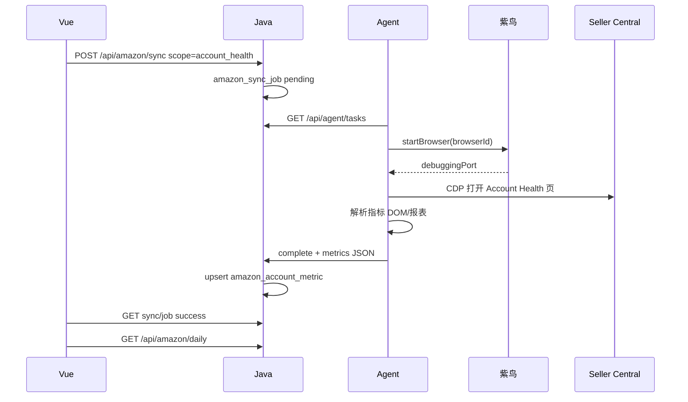

# Amazon × 紫鸟 — 技术设计

## 1. 总体架构

```
┌─────────────────────────────────────────────────────────────────┐
│ Vue (:5173)                                                      │
│  AccountBindingView ──紫鸟导入──► AmazonModuleView ──刷新──►     │
│  amazonApi.js / platformAccounts.js                              │
└────────────────────────────┬────────────────────────────────────┘
                             │ /api/amazon/* /api/agent/*
┌────────────────────────────▼────────────────────────────────────┐
│ Java Spring Boot (:18080)                                        │
│  AmazonController / AgentController / PlatformAccount 扩展        │
│  AmazonSyncService ──► amazon_sync_job / amazon_* 表             │
└────────────────────────────┬────────────────────────────────────┘
                             │ Agent 轮询 tasks / 上报结果
┌────────────────────────────▼────────────────────────────────────┐
│ CrossHub Agent (backend/python/agent/)  【办公机常驻】            │
│  poll_tasks ──► ZiniaoClient ──► POST 127.0.0.1:16851           │
│  amazon/report_crawler.py ──► Playwright connect_over_cdp        │
└────────────────────────────┬────────────────────────────────────┘
                             │
┌────────────────────────────▼────────────────────────────────────┐
│ 紫鸟 WebDriver 模式                                              │
│  startBrowser(browserId) → debuggingPort → 独立 IP 店铺环境       │
│  PoC: YOTO美国账号 browserId=16505337258263 IP=47.76.147.2      │
└─────────────────────────────────────────────────────────────────┘
```

**与 Temu 差异**：Temu 由 Java 直接 `ProcessBuilder` 调 Python；Amazon 必须先经 **紫鸟本地 API**，且 Agent 与紫鸟同机（`127.0.0.1:16851` 不可远程）。

## 2. 紫鸟 WebDriver 对接（已实现 PoC）

| 项 | 说明 |
|----|------|
| 文档 | [open.ziniao.com docId=98](https://open.ziniao.com/docSupport?docId=98) |
| 启动 | `ziniao.exe --run_type=web_driver --ipc_type=http --port=16851` |
| 列表 | `POST /api/browser/list` `action=getBrowserList` |
| 开店 | `POST /api/browser/start` `action=startBrowser` + `browserId` |
| 关店 | `POST /api/browser/stop` `action=stopBrowser` |
| 自动化 | 响应 `debuggingPort` → `playwright.chromium.connect_over_cdp` |

**代码位置**：

| 组件 | 路径 |
|------|------|
| HTTP 封装 | `backend/python/app/ziniao/client.py` |
| 配置 | `backend/python/app/config.py`（`ZINIAO_*`） |
| 探测脚本 | `backend/python/scripts/probe_ziniao.py` |

**状态码**（实施须处理）：

| statusCode | 含义 | 处理 |
|------------|------|------|
| 0 | 成功 | — |
| -10003 | 登录失败 / 无 WebDriver 权限 | 检查子账号权限、Boss 开放平台 |
| -10006 | 上次 startBrowser 未完成 | 等待或 stopBrowser |
| 2 | IP 不可用 | 任务 failed，提示检查紫鸟设备 |
| 7 | 内核启动失败 | 重试 1 次，仍失败则告警 |

## 3. CrossHub Agent

### 3.1 职责

- 注册节点：`POST /api/agent/register` → `agent_token` + `node_id`
- 心跳：`POST /api/agent/heartbeat`（紫鸟在线、WebDriver 端口、已开店铺数）
- 拉任务：`GET /api/agent/tasks?node_id=` → `discover` | `sync` | `oauth`
- 回报：`POST /api/agent/tasks/{id}/complete`（JSON 结果 / 文件路径 / 错误码）

### 3.2 目录规划

```
backend/python/
  agent/
    __init__.py
    main.py                 # 常驻：heartbeat + poll loop
    config.py               # AGENT_NODE_ID, AGENT_TOKEN, JAVA_BASE_URL
  app/ziniao/client.py      # 已有
  app/amazon/
    report_crawler.py       # Account Health / Business Report
    parsers/
      account_health.py
      business_report.py
  scripts/
    probe_ziniao.py         # 已有
    run_agent.py            # 启动 Agent
```

### 3.3 同步任务状态机（对齐 `temu_crawl_job`）

```
pending → running → success | failed
```

- Java 创建 job 时写 `pending`，Agent 领取后改 `running`
- 同一 `platform_account_id` + `scope` 进行中 → 409 Conflict
- `mode`: `ziniao_webdriver`（一期固定）

## 4. 数据模型

### 4.1 `platform_account` 扩展

```sql
ALTER TABLE platform_account ADD COLUMN external_shop_id TEXT;      -- 紫鸟 browserId 字符串
ALTER TABLE platform_account ADD COLUMN ziniao_browser_oauth TEXT;  -- 加密 oauth，可选
ALTER TABLE platform_account ADD COLUMN integration_mode TEXT DEFAULT 'ziniao';
ALTER TABLE platform_account ADD COLUMN amazon_region TEXT;         -- NA | EU | FE
ALTER TABLE platform_account ADD COLUMN agent_node_id TEXT;
CREATE INDEX idx_pa_external ON platform_account(tenant_id, platform, external_shop_id);
```

**绑定规则**：

- CrossHub `platform_accounts.id`（UUID）= 业务主键（前端 `storeId`）
- `external_shop_id` = 紫鸟 `browserId`（如 `16505337258263`）
- 一店一行；禁止多 CrossHub 记录指向同一 `browserId`

### 4.2 新表

```sql
-- Agent 节点
CREATE TABLE integration_agent (
  id TEXT PRIMARY KEY,
  tenant_id INTEGER NOT NULL,
  name TEXT NOT NULL,
  status TEXT NOT NULL DEFAULT 'active',
  last_heartbeat_at TEXT,
  ziniao_online INTEGER DEFAULT 0,
  meta_json TEXT
);

-- 同步任务
CREATE TABLE amazon_sync_job (
  id TEXT PRIMARY KEY,
  tenant_id INTEGER NOT NULL,
  platform_account_id TEXT NOT NULL,
  agent_id TEXT,
  scope TEXT NOT NULL,
  status TEXT NOT NULL,
  mode TEXT NOT NULL DEFAULT 'ziniao_webdriver',
  error_code TEXT,
  error_message TEXT,
  result_summary TEXT,
  created_at TEXT NOT NULL,
  started_at TEXT,
  finished_at TEXT
);
CREATE INDEX idx_amazon_job_tenant_status ON amazon_sync_job(tenant_id, status);

-- 账户状况（日报）
CREATE TABLE amazon_account_metric (
  id TEXT PRIMARY KEY,
  tenant_id INTEGER NOT NULL,
  platform_account_id TEXT NOT NULL,
  metric_key TEXT NOT NULL,
  metric_label TEXT,
  status TEXT NOT NULL,
  value_text TEXT,
  synced_at TEXT NOT NULL,
  UNIQUE(tenant_id, platform_account_id, metric_key, synced_at)
);

-- 买家消息 / Review / Case 等按 scope 分期建表，字段对齐 constants/amazonDaily.js
```

### 4.3 前端字段契约（与 Demo 对齐）

日报 `GET /api/amazon/daily` 响应结构：

```json
{
  "code": 0,
  "data": {
    "synced_at": "2026-07-09T10:00:00",
    "buyer_messages": [],
    "account_metrics": [
      {
        "id": "metric_odr",
        "store_id": "<platform_account.uuid>",
        "metric_key": "order_defect_rate",
        "label": "订单缺陷率",
        "status": "normal",
        "value_text": "0.3%",
        "synced_at": "2026-07-09T10:00:00"
      }
    ],
    "reviews": [],
    "coupons": [],
    "seller_news": [],
    "shipments": [],
    "cases": []
  }
}
```

> 响应 Record DTO 使用 **snake_case**（`application.yml`）；前端 `map*` 双读 camelCase。

Boss `GET /api/amazon/insights`：

```json
{
  "code": 0,
  "data": {
    "products": [{ "id", "store_id", "asin", "sku", "name", "sales_7d", "acos" }],
    "outbound_orders": [{ "id", "store_id", "order_no", "status", "fulfillment" }]
  }
}
```

## 5. Java API 设计

| 方法 | 路径 | 说明 |
|------|------|------|
| POST | `/api/agent/register` | Boss 创建节点，返回 token |
| POST | `/api/agent/heartbeat` | Agent 心跳（Header: `X-Agent-Token`） |
| GET | `/api/agent/tasks` | Agent 拉取 pending 任务 |
| POST | `/api/agent/tasks/{id}/complete` | Agent 完成回报 |
| POST | `/api/amazon/ziniao/discover` | 创建 discover 任务 |
| GET | `/api/amazon/ziniao/candidates` | 最近一次 discover 结果 |
| POST | `/api/amazon/ziniao/bind` | 绑定 browserId → platform_account |
| POST | `/api/amazon/sync` | `{ "platform_account_id", "scope" }` → 202 job |
| GET | `/api/amazon/sync/{jobId}` | 轮询状态 |
| GET | `/api/amazon/daily?store_id=` | 日报读库 |
| GET | `/api/amazon/insights?store_id=` | Boss 读库 |
| PATCH | `/api/amazon/messages/{id}` | P3：标记已回复 |
| PATCH | `/api/amazon/reviews/{id}` | P3 |
| PATCH | `/api/amazon/cases/{id}` | P3 |
| PATCH | `/api/amazon/outbound/{id}` | P3：标记已发货 |

**权限**：

- Boss：discover、bind、register agent、全店读
- 员工：仅 `user_shop_scope` / `user_platform_scope` 内 `store_id`
- Agent：仅 `X-Agent-Token`，仅能 complete 本 tenant 任务

## 6. 前端改动

| 文件 | 改动 |
|------|------|
| `src/api/amazonApi.js` | **新建**：sync 轮询、daily、insights |
| `src/api/amazon.js` | Facade：`hasBackendSession` → Api，否则 Local |
| `src/api/platformAccounts.js` | 紫鸟导入绑定流程 |
| `src/views/boss/AccountBindingView.vue` | 「从紫鸟导入」按钮 |
| `src/views/amazon/AmazonModuleView.vue` | 刷新调 sync；去 Demo 提示 |
| `src/utils/platformOperationalMode.js` | `amazon` 加入 `BACKEND_OPERATIONAL_PLATFORMS`（条件：Agent 在线） |
| `src/api/operationsOverview.js` | `buildAmazonSection` 调 API |
| `vite.config.js` | `/api/amazon`、`/api/agent` → `18080` |

## 7. P1 爬取流程（Account Health）



**人工介入**：遇 MFA/验证码 → job `failed` + `error_code=AMAZON_NEEDS_MANUAL_LOGIN`，UI 提示在紫鸟窗口手动登录后重试。

## 8. 配置

### `backend/python/.env`（gitignore）

```env
ZINIAO_COMPANY=泰州亿拓户外有限公司
ZINIAO_USERNAME=HangZhouYiTuo
ZINIAO_PASSWORD=***
ZINIAO_SOCKET_PORT=16851
```

### `application.yml` 新增

```yaml
crosshub:
  amazon:
    agent-poll-interval-seconds: 10
    sync-timeout-seconds: 600
    allowed-scopes: account_health,daily,reports,insights
```

## 9. 风险与对策

| 风险 | 对策 |
|------|------|
| 紫鸟普通模式与 WebDriver 互斥 | Agent 启动前检测；文档 + UI 提示 |
| 页面改版 | 解析器版本号；失败保留截图路径 |
| 并发开多店 OOM | Agent `max_workers=2` |
| 凭据泄露 | 仅 `.env`；Agent token 可轮换 |
| Demo 泄漏 | `amazon.js` 后端模式禁止 import Local seed |

## 10. 参考实现（仓库内）

| 参考 | 路径 |
|------|------|
| 异步 crawl job | `TemuCrawlServiceImpl.java` |
| AliExpress Controller | `AliExpressController.java` |
| Playwright 上下文 | `app/browser/context.py`（紫鸟场景改 CDP attach） |
| 平台 Demo 门禁 | `platformOperationalMode.js` |
| 分平台清单 | `docs/api-integration/02-其余平台接口对齐清单.md` §3 |
