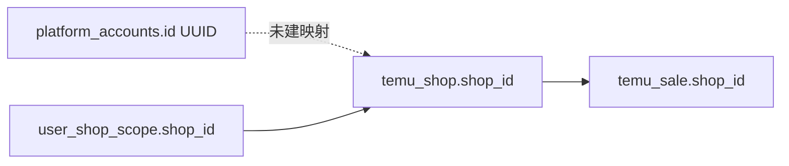

# 前后端 API — 未联调 / 未做实清单

> 项目根目录：`SaaS-HZ_WEB_Demo`  
> 关联：`03-PRD实施包.md`、`04-测试用例.md`  
> 审查基准：2026-07-06（Java Controller 9 个；前端 `src/api/*.js` 52 个）

## 背景

默认模式为 **后端模式**（`VITE_USE_TEMU_BACKEND` 未显式设为 `false`）。Boss/员工/仓库登录走 Java `:18080`；Vite 将 `/api/auth`、`/api/tenant`、`/api/warehouse`、`/api/platform-accounts`、`/api/temu` 代理至 Java，其余 `/api` 仍指向 Express `:3000`（当前业务几乎未用）。

本文档区分三类能力：

| 类别 | 含义 |
|------|------|
| **A. 已联调** | 前端有 `*Api.js` 或 `service.*` 调 Java，且字段契约基本对齐 |
| **B. 半联调** | 有 Java API，但前端仍混用 localStorage、Demo 种子、或 ID 域不一致 |
| **C. 未联调** | 仅 `*Local.js` / 常量种子，Java 无对应 Controller |

---

## 一、Java 后端已有端点（基线）

| Controller | 前缀 | 方法摘要 |
|------------|------|----------|
| `AuthController` | `/api/auth` | register, login, session, menus |
| `PlatformAccountController` | `/api/platform-accounts` | list, bind, bind-batch, delete |
| `TenantMemberController` | `/api/tenant` | members CRUD, scopes, status, assignable-menus |
| `TenantFeatureController` | `/api/tenant/features` | GET, PUT |
| `WarehouseSiteController` | `/api/warehouse/sites` | CRUD + status |
| `WarehouseStaffController` | `/api/warehouse/members` | CRUD + status |
| `WarehouseOrderController` | `/api/warehouse/orders` | list, get, create, review, release, ship, cancel, delete |
| `TemuController` | `/api/temu` | shops, operational, trend |
| `TemuCrawlController` | `/api/temu/crawl` | POST crawl, GET crawl/{jobId} |

**Java 当前不存在**：任务分配、运营反馈、竞品分析、平台推仓、非 Temu 平台运营数据（订单/违规/Listing/日报等）。

---

## 二、前端模块对照表

### A. 已联调（可验收）

| 前端模块 | 关键函数 | Java 端点 | 备注 |
|----------|----------|-----------|------|
| `auth.js` | loginBoss/Employee/Warehouse, register | `/api/auth/*` | `portal_role` 已 snake_case |
| `request.js` | backendLogin, fetchBackendSession | 同上 | |
| `platformAccountsApi.js` | CRUD bind | `/api/platform-accounts` | 请求体须 `store_name` 等 snake_case |
| `employees.js` | members CRUD, scopes, menus | `/api/tenant/members` | `shop_ids` / `menu_codes` 已对齐 |
| `tenantFeatures.js` | features GET/PUT | `/api/tenant/features` | `feature_code` 已对齐 |
| `warehouseSites.js` | sites CRUD | `/api/warehouse/sites` | 请求体须 `sort_order` |
| `warehouseStaff.js` | members CRUD | `/api/warehouse/members` | 请求体须 `warehouse_ids` |
| `warehouseOrdersApi.js` | orders 全流程 | `/api/warehouse/orders` | body 为 Map，字段 camelCase |
| `temuApi.js` | shops, operational, trend, crawl | `/api/temu/*` | query 用 `shop_id` |

### B. 半联调（需做实）

| ID | 前端 | 问题 | 目标 |
|----|------|------|------|
| **HALF-01** | `platformAccounts.js` | 绑定走 Java，但各平台 `fetch*Stores` 在后端模式仍可能触发 `ensure*DemoData`（若未门禁） | 后端模式：店铺列表 100% 来自 `platform_accounts` |
| **HALF-02** | `operationsOverview.js` | Temu 运营数据与账户绑定 `id`（UUID）≠ 爬虫 `shop_id` | 总览店铺数以绑定为准；Temu 问题数据以 operational 为准，需 ID 映射策略 |
| **HALF-03** | `temuApi.js` `fetchTemuStores` | Temu 模块店铺下拉来自 `/api/temu/shops`，与账户绑定表独立 | 统一：绑定账号 → 爬虫 shop 映射表，或运营页改用绑定店铺 + shop_id 解析 |
| **HALF-04** | `warehouseOrders.js` | 后端列表与 `localStorage` 平台推仓单合并 | 平台推仓有 Java API 前：文档化「仅本地」；或后端增加 `source_platform_order_id` |
| **HALF-05** | `employees.js` | `fetchAssignableMenus` 失败时曾静默回退硬编码 | 后端模式：失败即报错，不回退 |
| **HALF-06** | `warehouseStaff.js` / `warehouseSites.js` | 同上静默 local 回退 | 后端模式：仅 Java |
| **HALF-07** | `TemuMapper.toPlatformAccountDto` | 响应混用 camelCase（`storeName`），与全局 SNAKE_CASE 不一致 | 前端 `mapStore` 双读；长期统一响应规范 |
| **HALF-08** | 运营总览 `buildTemuSection` | `bound` 曾依赖 Demo 商品数 | 已改为 `stores.length`；需回归 |
| **HALF-09** | `auth.js` session | `shop_scope` / `warehouse_scope` 与 `platform_accounts.id` 是否一致 | 员工 scope 应使用绑定店铺主键（见 permissions P2 shop_id 统一） |
| **HALF-10** | Express `/api` 兜底 | `vite.config.js` 未匹配路径 → `:3000` | 确认无业务误打 Express；或移除兜底 |

### C. 未联调（仅 Local / 常量）

| ID | 前端模块 | 能力 | 消费页面 |
|----|----------|------|----------|
| **LOCAL-01** | `assignedTasks.js` + `assignedTasksLocal.js` | 任务分配 CRUD、状态、反馈同步 | 任务分配、员工/仓库任务 |
| **LOCAL-02** | `opsFeedback.js` + `opsFeedbackLocal.js` | 运营反馈提交/查询 | 员工任务、运营总览日报 |
| **LOCAL-03** | `temuCompetitors.js` + `*Local.js` | 竞品 URL、快照分析 | Temu 竞品分析 |
| **LOCAL-04** | `platformShipRequests.js` | 平台订单推仓库出库单 | 各平台运营页、PlatformShipPushDialog |
| **LOCAL-05** | `aliexpress.js` + `*Local.js` | 订单、违规 | AliExpress 运营 |
| **LOCAL-06** | `walmart.js` + `*Local.js` | 订单、Listing 问题 | Walmart 运营 |
| **LOCAL-07** | `amazon.js` + `*DailyLocal.js` | 日报、消息、Review 等 | Amazon 运营 |
| **LOCAL-08** | `domesticPlatforms.js` + `*Local.js` | 拼多多/抖音/视频号 | 国内平台运营 |
| **LOCAL-09** | `alibaba1688.js` + `*DemoLocal.js` | 采购单、供应商预警 | 1688 运营 |
| **LOCAL-10** | `dtc.js` + `*Local.js` | 独立站订单 Demo | DTC 运营 |
| **LOCAL-11** | `temuRestockLocal.js` | 备货跟进状态 | 运营总览 Temu 板块 |
| **LOCAL-12** | `operationsOverview.js`（非 Temu） | 聚合各平台 Local 数据 | 运营总览、员工工作台 |
| **LOCAL-13** | `employeeTasks.js` | 硬编码 `OPERATION_TASKS` + Local 分配任务 | 员工任务中心、Boss 任务 |

---

## 三、Jackson SNAKE_CASE 契约清单

后端 `application.yml`：`property-naming-strategy: SNAKE_CASE`（**Record DTO 生效**；`Map<String,Object>` 出库单等保持 JSON 原样 key）。

| 方向 | 正确示例 | 常见错误 |
|------|----------|----------|
| 请求 Record | `store_name`, `company_name`, `shop_ids`, `warehouse_ids`, `sort_order`, `portal_role`, `feature_code` | 发 camelCase 导致字段为 null |
| 响应 Record | 读 `store_name` 或前端 `map*` 双读 | 只读 `storeName` 可能为空 |
| 响应 Map（warehouse order） | `warehouseId`, `sourcePlatform` | 与 Record 规则不同，勿混用 |

---

## 四、数据主键未统一（阻塞「做实」）

| 域 | 主键 | 使用方 |
|----|------|--------|
| 账户绑定 | `platform_accounts.id` | 账户绑定页、员工 `shop_ids`（部分） |
| Temu 爬虫 | `temu_shop.shop_id` | `/api/temu/shops`、`operational` |
| 运营总览 Temu | 两套 ID 混用 | 绑定有店、运营数据为空 |

**依赖**：permissions 文档 P2「shop_id 统一」或新增 `platform_account.external_shop_id` 映射表。

---

## 五、优先级建议

| 优先级 | 范围 | 说明 |
|--------|------|------|
| **P0** | HALF-01～08、契约回归 | 不新增 Java，前端+契约+总览做实 |
| **P1** | HALF-09、shop_id 映射 | 员工 scope 与 Temu 数据一致 |
| **P2** | LOCAL-04 平台推仓 | 出库单 `source_*` 与 Java 打通 |
| **P3** | LOCAL-01～02 任务/反馈 | 新 Controller + 表结构 |
| **P4** | LOCAL-05～10 各平台运营 | 分平台迭代或继续 Demo 占位 |

---

## 六、与 permissions 文档交叉项

| permissions ID | 本清单关联 |
|----------------|------------|
| P2 shop_id 统一 | HALF-02、HALF-03、HALF-09 |
| M4 warehouse grant | `WarehouseOrderServiceImpl` 已校验；前端须透传后端错误 |
| 非 Temu 数据 scope | LOCAL-05～10，Java 未实现 |

---

## 七、审查结论（一句话）

**认证、绑定、组织（员工/仓库/功能开关）、出库单、Temu 读数与爬取已具备 Java 能力；运营总览与各平台运营页、任务协同、推仓链路仍大量依赖 localStorage Demo，且 Temu「绑定店铺 ID」与「爬虫 shop_id」未统一是后端模式下最常见的「有绑定无数据」根因。**
