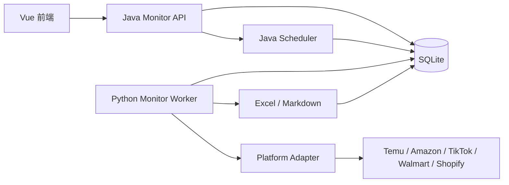
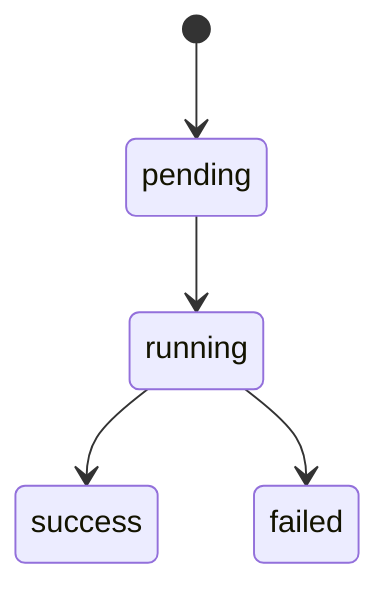

# 通用竞店监控框架技术设计

## 1. 方案结论

采用“第二版架构”：

- Java 负责控制面：
  - 目标管理
  - 计划管理
  - 手动触发
  - latest/history/job 查询
  - 定时调度
- Python 负责执行面：
  - 消费 `pending` job
  - 调用平台 adapter 抓取
  - 分析信号
  - 生成报表
  - 写回快照与任务结果
- Java 与 Python 共享 SQLite 数据库。

这个方案最适合“监控型任务”，因为状态统一、易扩展、易调度、易追踪。

## 2. 总体架构

## 3. 模块设计

### 3.1 Java 控制面

核心文件：

- [MonitorController.java](D:/NIUBI/SaaS-HZ_WEB_Demo/backend/java/src/main/java/com/crosshub/temu/controller/MonitorController.java)
- [MonitorService.java](D:/NIUBI/SaaS-HZ_WEB_Demo/backend/java/src/main/java/com/crosshub/temu/service/MonitorService.java)
- [MonitorServiceImpl.java](D:/NIUBI/SaaS-HZ_WEB_Demo/backend/java/src/main/java/com/crosshub/temu/service/impl/MonitorServiceImpl.java)
- [MonitorScheduler.java](D:/NIUBI/SaaS-HZ_WEB_Demo/backend/java/src/main/java/com/crosshub/temu/service/impl/MonitorScheduler.java)

职责：

- 管理监控目标与计划。
- 创建手动/调度任务。
- 判断 freshness。
- 查询最新快照、历史快照、任务状态。
- 处理同目标活跃任务冲突。

### 3.2 Python 执行面

核心文件：

- [monitor_worker.py](D:/NIUBI/SaaS-HZ_WEB_Demo/backend/python/monitor_worker.py)
- [monitor_worker_service.py](D:/NIUBI/SaaS-HZ_WEB_Demo/backend/python/app/monitor_worker_service.py)
- [monitor_db.py](D:/NIUBI/SaaS-HZ_WEB_Demo/backend/python/app/monitor_db.py)
- [temu_monitor_adapter.py](D:/NIUBI/SaaS-HZ_WEB_Demo/backend/python/app/platforms/temu_monitor_adapter.py)

职责：

- 抢占一个 `pending` job 并更新为 `running`。
- 按平台路由 adapter。
- 生成快照、商品快照、信号、报表。
- 将 job 标记为 `success` 或 `failed`。
- 回填 `monitor_target.latest_snapshot_*`。

### 3.3 前端联调层

核心文件：

- [temuCompetitorsApi.js](D:/NIUBI/SaaS-HZ_WEB_Demo/dev/vue-site/src/api/temuCompetitorsApi.js)
- [CompetitorAnalysis.vue](D:/NIUBI/SaaS-HZ_WEB_Demo/dev/vue-site/src/components/temu/CompetitorAnalysis.vue)

设计原则：

- 保留原有本地 demo 模式。
- 仅在 `useBackendData` 分支切到 `/api/monitor/*`。
- 前端统一把 monitor API 响应映射为页面既有报表结构。

## 4. 数据库设计

当前实现数据库：SQLite。

关键表：

- `monitor_target`
- `monitor_schedule`
- `monitor_job`
- `monitor_snapshot`
- `monitor_product_snapshot`
- `monitor_signal`

表职责：

- `monitor_target`：目标主表，记录平台、URL、freshness、最新快照指针。
- `monitor_schedule`：调度配置。
- `monitor_job`：任务实例和状态机。
- `monitor_snapshot`：一次成功抓取的汇总头。
- `monitor_product_snapshot`：商品明细快照。
- `monitor_signal`：分析信号。

## 5. API 设计

### 5.1 目标管理

- `POST /api/monitor/targets`
- `PUT /api/monitor/targets/{id}`
- `DELETE /api/monitor/targets/{id}`
- `GET /api/monitor/targets`
- `GET /api/monitor/targets/{id}`

### 5.2 调度与执行

- `PUT /api/monitor/targets/{id}/schedule`
- `POST /api/monitor/targets/{id}/trigger`
- `GET /api/monitor/jobs/{jobId}`

### 5.3 查询

- `GET /api/monitor/targets/{id}/latest`
- `GET /api/monitor/targets/{id}/history`

## 6. 状态机设计

状态规则：

- 同一目标同一时刻只允许一个活跃任务：`pending` 或 `running`。
- `trigger` 与 scheduler 都要做冲突检查。
- latest 查询不依赖明细表，优先读取目标头和最近任务。

## 7. freshness 设计

判定来源：

- `monitor_target.latest_snapshot_at`
- `monitor_target.freshness_minutes`

逻辑：

1. 读取目标头记录。
2. 若无 `latest_snapshot_at`，则 `has_fresh_data=false`。
3. 若当前时间减去 `latest_snapshot_at` 小于等于 freshness，则命中 fresh。
4. 否则返回 miss，并根据是否有活跃任务决定 `can_trigger_now`。

## 8. 调度设计

Java Scheduler 周期扫描：

- `enabled = 1`
- `target.status = active`
- `next_run_at <= now`

处理步骤：

1. 查找到期计划。
2. 检查目标是否已有活跃 job。
3. 若无，则创建 `pending` job。
4. 更新 `last_run_at` 与新的 `next_run_at`。

说明：

- Scheduler 只负责“创建任务”，不负责执行抓取。
- interval 与 cron 都由 Java 侧计算下一次时间。

## 9. Worker 设计

Worker 主链路：

1. 读取最早的 `pending` job。
2. CAS 式更新为 `running`。
3. 读取 target 与 schedule。
4. 按 `platform` 选择 adapter。
5. adapter 返回商品列表。
6. 生成分析结果：
   - 近期上新
   - 异常销售
7. 生成报表：
   - `final.md`
   - `report.xlsx`
8. 落库 snapshot / product_snapshot / signal。
9. 回填 target 最新快照。
10. 更新 job 成功或失败。

## 10. 报表设计

落地目录：

- `reports/monitor/<platform>/<target_id>/<date>/final.md`
- `reports/monitor/<platform>/<target_id>/<date>/report.xlsx`

Excel 工作表：

- `Summary`
- `All Products`
- `Recent Launch`
- `Sales Outliers`

## 11. 扩展设计

平台扩展统一遵循 adapter 规范：

- 输入：`tenant_id`、`target`、`max_products`
- 输出：标准商品列表与抓取时间

后续扩平台时：

- Java 侧无需重写调度和状态逻辑。
- 主要新增 Python adapter 与少量前端文案映射。

## 12. 当前落地状态

- P0：已完成
  - Monitor 核心表
  - CRUD / schedule / trigger / latest / job 查询
- P1：已完成
  - Python worker
  - snapshot / product_snapshot / signal / 报表产物
- P2：已完成主体
  - Java Scheduler
  - history 查询
  - 前端 backend 模式接 monitor API

## 13. 风险与应对

- SQLite 并发写锁
  - 首期控制 worker 并发
  - 任务写入保持短事务
  - 后续可迁移 PostgreSQL

- 平台抓取稳定性
  - 错误码、错误消息写入 job
  - latest 查询不因本次失败而覆盖旧快照

- 多平台字段差异
  - 通用表只保留共性字段
  - 平台特有数据放 adapter 或原始扩展字段
