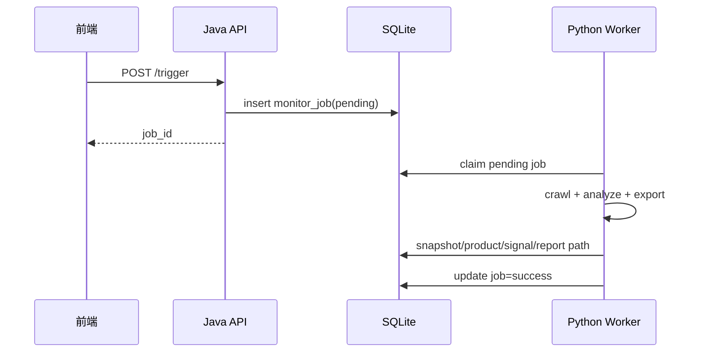
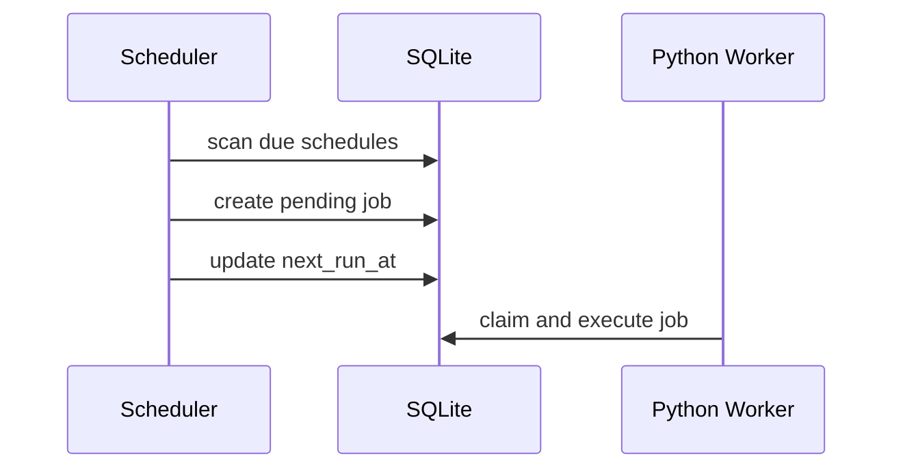

# 通用竞店监控框架 PRD 实施包

## 1. 实施范围

本实施包基于“第二版架构”落地：

- Java 控制面
- Python Worker 执行面
- 共享 SQLite
- Temu 作为首个平台 adapter
- 前端竞店页接入 monitor API

## 2. 里程碑

| 阶段 | 内容 | 当前状态 |
|---|---|---|
| P0 | 通用 monitor 核心表、Java API、手动触发、latest 查询 | 已完成 |
| P1 | Python Worker、Temu adapter、快照/信号/报表落库 | 已完成 |
| P2 | Java Scheduler、history、前端联调、回归验证 | 已完成主体 |

## 3. 已落地接口

### 3.1 监控目标

- `POST /api/monitor/targets`
- `PUT /api/monitor/targets/{id}`
- `DELETE /api/monitor/targets/{id}`
- `GET /api/monitor/targets`
- `GET /api/monitor/targets/{id}`

### 3.2 计划与触发

- `PUT /api/monitor/targets/{id}/schedule`
- `POST /api/monitor/targets/{id}/trigger`

### 3.3 状态与历史

- `GET /api/monitor/targets/{id}/latest`
- `GET /api/monitor/jobs/{jobId}`
- `GET /api/monitor/targets/{id}/history`

## 4. 返回契约摘要

### 4.1 `latest`

关键字段：

- `has_fresh_data`
- `latest_snapshot_id`
- `latest_snapshot_at`
- `latest_job_status`
- `can_trigger_now`
- `reason`
- `summary`
- `signals`
- `artifacts`

### 4.2 `history`

返回：

- `snapshots`
- `jobs`

### 4.3 `trigger`

成功时：

- HTTP `202`
- 返回 `job_id`

冲突时：

- HTTP `409`
- 错误码 `MONITOR_JOB_IN_PROGRESS`

## 5. 表结构落地

### 5.1 P0

- `monitor_target`
- `monitor_schedule`
- `monitor_job`

### 5.2 P1

- `monitor_snapshot`
- `monitor_product_snapshot`
- `monitor_signal`

## 6. 核心流程

### 6.1 手动触发

### 6.2 自动调度

## 7. 实施清单

### 7.1 Java

- 新增 MonitorController
- 新增 MonitorService/Impl
- 新增 MonitorScheduler
- 新增 monitor 相关 migration
- latest freshness 判定
- history 查询
- trigger 冲突保护

### 7.2 Python

- 新增 `monitor_worker.py`
- 新增 `app/monitor_worker_service.py`
- 新增 `app/monitor_db.py`
- 新增 `app/platforms/base.py`
- 新增 `app/platforms/temu_monitor_adapter.py`
- 生成 Excel/Markdown 报表

### 7.3 前端

- backend 模式下目标列表改接 `/api/monitor/targets`
- 分析流程改为：
  - 先查 `latest`
  - miss 时触发 `trigger`
  - 轮询 `job`
  - 再查 `latest` 与 `history`
- 页面新增：
  - fresh/miss 状态
  - job 状态
  - 报表产物路径
  - 快照历史
  - 任务历史

## 8. 部署与运行

### 8.1 Java

- 启动 Monitor API
- 启用 Scheduler
- 配置与 Python 共用数据库路径

### 8.2 Python

- 启动常驻 Worker
- 指向相同 SQLite
- 保证 report 目录可写

### 8.3 前端

- backend 模式开启后走 monitor API
- demo 模式保持原有本地数据逻辑

## 9. 验收项

- 可创建 Temu 监控目标。
- 可配置 interval/cron。
- `trigger` 可返回 `job_id`。
- Worker 可消费 `pending` job。
- latest 可正确命中 fresh/miss。
- 可生成 snapshot、signal 与 Excel/Markdown 报表。
- history 可返回 snapshots 和 jobs。
- 前端 backend 模式可完整展示监控信息。
