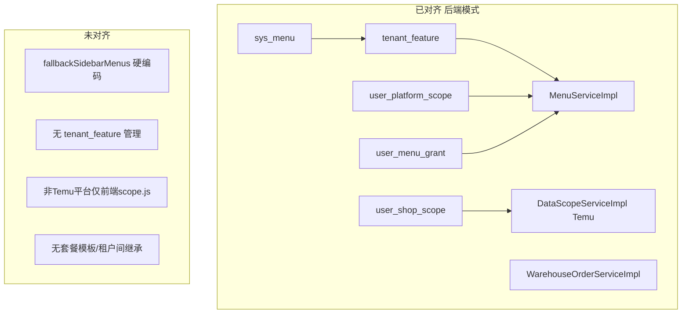
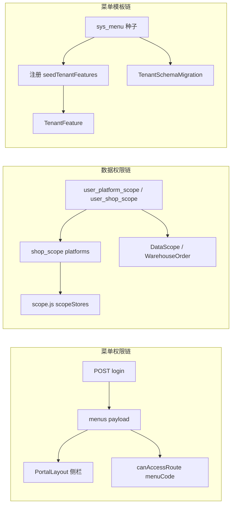

# 权限体系 — 未对齐清单

> 项目根目录：`SaaS-HZ_WEB_Demo`  
> 关联：`02-技术债清单.md`、`03-PRD实施包.md`、`04-回归测试用例.md`

## 背景

CrossHub 在后端模式（`VITE_USE_TEMU_BACKEND=true` + Java 登录）下，菜单权限与 Temu/仓库数据权限已在 Java 层落地；默认 Demo 模式、租户功能开关、非 Temu 平台数据权限、菜单模板运营四块与目标设计未对齐。本文档记录**现状 vs 目标**，作为 PRD 与回归测试输入。

---

## 一、架构现状

### 1.1 已对齐 vs 未对齐（三域对照）

**A. 菜单权限**

| 能力 | 已实现 | 未对齐 |
|------|--------|--------|
| Boss 侧栏 | 后端 `menusForUser` + `tenant_feature` 过滤 | Demo 模式走 `menuAuth.js` `fallbackSidebarMenus`，与 `sys_menu` 不同步 |
| 员工侧栏 | 平台 scope 推导 module 菜单 | 可分配 grant 仅 `employee.warehouse`（`MemberScopeServiceImpl`） |
| 路由守卫 | `backendLinked` 时用 `hasMenuCode` | Demo 模式仅 `role` + 路径集合，`router/index.js` 的 `menuCode` 不生效 |

**B. 数据权限**

| 能力 | 已实现 | 未对齐 |
|------|--------|--------|
| Temu 店铺/销售 | `DataScopeServiceImpl` 强制过滤 | `user_shop_scope` 仅对接 `temu_shop.shop_id` |
| 仓库订单 | `WarehouseOrderServiceImpl` 按提交人/分仓 | 员工 `employee.warehouse` 菜单与订单 scope 无后端联动校验 |
| 其他平台 | 前端 `scope.js` `scopeStores` | 无 Java API 级店铺过滤；`platform_account` 仅 tenant 级 |

**C. 菜单模板继承**

| 能力 | 已实现 | 未对齐 |
|------|--------|--------|
| 全局目录 | 迁移 `seedMenus()` | `sys_menu` 变更不回流已有租户 |
| 新租户初始化 | 注册时 `seedTenantFeatures` 全量拷贝 | 无套餐模板、无 Boss 开关 UI、无父子租户继承 |

### 1.2 架构图

### 1.3 三条权限链路

**断层**：Demo 模式绕过 `menuChain` 的 Java 段；`dataChain` 在 Temu 外仅前端；`tmplChain` 无运行时运营与增量同步。

---

## 二、未对齐项明细

### A. 菜单权限

| ID | 未对齐项 | 现状 | 目标 |
|----|----------|------|------|
| MENU-01 | Demo 侧栏与 `sys_menu` 双源 | `menuAuth.js` `fallbackSidebarMenus` 硬编码 | 单一菜单源或静态导出与 `sys_menu` 同步 |
| MENU-02 | 路由守卫双轨 | `backendLinked` vs Demo path/role | 统一按 `menuCode` 判定 |
| MENU-03 | 可分配菜单过少 | 仅 `employee.warehouse` grant | 明确平台菜单 vs 附加菜单策略 |
| MENU-04 | Boss 设置组路由 | group path `#`，Demo 直链可能绕过 | 子路由 `menuCode` 全覆盖 |
| MENU-05 | 员工 base 菜单默认可见 | `menu_type=base` 默认 true | 确认产品意图或改为 grant |

**关键文件**：`MenuServiceImpl.java`、`menuAuth.js`、`router/index.js`、`EmployeeBindingView.vue`

### B. 数据权限

| ID | 未对齐项 | 现状 | 目标 |
|----|----------|------|------|
| DATA-01 | 店铺范围仅 Temu 后端强制 | `DataScopeServiceImpl` + Temu shop_id | 统一 `platform_account.id` 或分平台主键 |
| DATA-02 | 非 Temu 无 Java 校验 | 仅 `scope.js` 前端过滤 | 真平台接入时补 Service scope |
| DATA-03 | `shop_scope` vs `assignedStoreIds` | Temu shop_id vs platform id | 统一 ID 空间 |
| DATA-04 | 仓管分仓与设置 API | 订单有分仓过滤；sites 为 Boss 专属 | 仓管只读分仓列表（如需） |
| DATA-05 | Demo 员工种子仅 tenant 1 | `employeesLocal` 跳过非 1 租户 | 多租户 Demo 样本或空列表 |

**关键文件**：`DataScopeServiceImpl.java`、`WarehouseOrderServiceImpl.java`、`scope.js`

### C. 菜单模板继承

| ID | 未对齐项 | 现状 | 目标 |
|----|----------|------|------|
| TMPL-01 | 无功能套餐 | 注册全量 `tenant_feature` | preset：`standard` / `temu_only` |
| TMPL-02 | 无运行时开关 | 无 features API/UI | Boss 功能开关页 |
| TMPL-03 | `sys_menu` 不同步 | 老租户无新 code | 迁移 backfill |
| TMPL-04 | 无租户间继承 | 独立 feature 集 | 可选模板租户复制 |

**关键文件**：`TenantRegistrationServiceImpl.java`、`TenantSchemaMigration.java`（无 `TenantFeatureController`）

---

## 三、模式对比

| 维度 | 后端模式 | Demo 模式 |
|------|----------|-----------|
| 菜单来源 | login → `menus` | `fallbackSidebarMenus` 硬编码 |
| 路由守卫 | `hasMenuCode` | path + `role` |
| 员工平台 | `auth.platforms` | `auth.employee.platforms` |
| 店铺范围 | `auth.shopScope` | `auth.employee.assignedStoreIds` |
| 租户功能 | `tenant_feature` | 无（全开硬编码） |

---

## 四、产品目标

| ID | 目标 |
|----|------|
| G1 | 后端模式菜单与数据权限可配置、可验证、可回归 |
| G2 | Demo 与后端权限语义一致（数据源可不同） |
| G3 | Boss 可管理租户功能集 |
| G4 | 为后续平台扩展预留统一 shop/平台 scope 模型 |

---

## 五、相关文档

- 技术债：`02-技术债清单.md`（PERM-01～08）
- PRD：`03-PRD实施包.md`（P0～P3）
- 测试：`04-回归测试用例.md`
- Temu 爬取权限：`docs/temu-crawl/04-测试用例清单.md`
